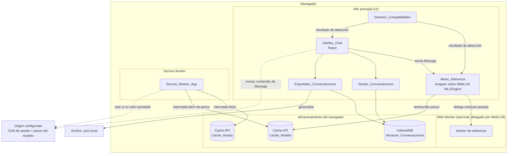
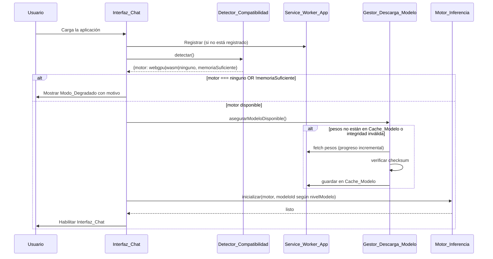

# Design Document

## Overview

El asistente de IA local es una aplicación web progresiva (PWA) que ejecuta un modelo de lenguaje completo dentro del navegador del usuario, sin ningún backend propio y sin llamadas a APIs de inferencia de terceros en tiempo de ejecución. Toda la inteligencia (detección de hardware, descarga y verificación del modelo, generación de texto, persistencia de conversaciones) ocurre en el cliente.

Los pilares del diseño son:

1. **Cero servidor de aplicación en runtime**: solo se sirven assets estáticos (HTML/CSS/JS/manifest/iconos) y los pesos del modelo, ambos cacheables. No existe un backend que reciba mensajes de usuario.
2. **Inferencia local mediante WebGPU/WASM**: se usa **WebLLM** (proyecto MLC-AI) como motor de inferencia.
3. **Resiliencia offline**: Service Worker + Cache API cubren assets y pesos del modelo; IndexedDB cubre el historial de conversaciones.
4. **Privacidad por construcción**: ninguna ruta de código realiza `fetch`/`XHR`/`WebSocket` con contenido de conversación. Esto se hace verificable con pruebas automatizadas (ver Correctness Properties).

### Decisión tecnológica: motor de inferencia

Se evaluaron dos opciones principales para ejecutar LLMs en el navegador: **WebLLM** (MLC-AI) y **Transformers.js** (Hugging Face, sobre ONNX Runtime Web).

| Criterio | WebLLM | Transformers.js |
|---|---|---|
| Backend principal | WebGPU (kernels compilados vía TVM/MLC), con fallback experimental | WebGPU (vía ONNX Runtime Web) o WASM |
| Modelos conversacionales grandes (7B-8B, chat-tuned) | Soporte de primera clase (Llama, Phi, Mistral, Gemma, Qwen cuantizados) | Enfocado más en modelos pequeños/tareas de NLP clásicas; LLMs conversacionales grandes menos maduros |
| API de streaming de chat | `MLCEngine.chat.completions.create({stream: true})`, compatible con la forma de la API de OpenAI | Requiere ensamblar el streaming manualmente sobre `pipeline` |
| Cacheo de pesos | Diseñado para cachear shards de pesos vía Cache API de forma nativa | Também usable con Cache API, pero pensado más para modelos de tareas puntuales |
| Rendimiento con GPU | ~80% del rendimiento nativo reportado por los autores (MLC-AI, 2024) [WebLLM: A High-Performance In-Browser LLM Inference Engine](https://blog.mlc.ai/2024/06/13/webllm-a-high-performance-in-browser-llm-inference-engine) | Bueno para modelos pequeños; menor enfoque en chat de propósito general |
| Fallback sin WebGPU | WASM disponible para algunos modelos, con degradación de rendimiento importante | WASM como backend estable de ONNX Runtime Web |

**Decisión: WebLLM** como motor de inferencia principal, porque el Requisito 4 exige una experiencia de chat conversacional con streaming, y el Requisito 1 exige selección explícita entre WebGPU y WASM como mecanismos de inferencia — ambas capacidades son de primera clase en WebLLM y su `MLCEngine` expone directamente el mecanismo activo. Fuente: [WebLLM API Reference](https://webllm.mlc.ai/docs/user/api_reference.html), [blog.mlc.ai](https://blog.mlc.ai/2024/06/13/webllm-a-high-performance-in-browser-llm-inference-engine).

Se define una interfaz `MotorInferencia` propia (ver Components) que envuelve a `MLCEngine`. Esto aísla el resto del sistema del SDK concreto y permite sustituirlo (p. ej. por Transformers.js) sin tocar la lógica de negocio, y permite mockearlo por completo en las pruebas.

### Decisión tecnológica: framework frontend

Se usa **React 18** con **Vite** como bundler/dev server, y **TypeScript**. Justificación:
- Vite tiene soporte de primera clase para generar un Service Worker (vía `vite-plugin-pwa`, que envuelve `Workbox`) y para el manifest de PWA, reduciendo el código de infraestructura hecho a mano para los Requisitos 3, 9 y 11.
- React separa naturalmente la Interfaz_Chat en componentes controlados, facilitando pruebas de UI aisladas (render + eventos) sin motor real.
- El estado del chat (mensajes, streaming, envío) se modela con un reductor puro (`useReducer` / máquina de estados explícita), lo cual es justamente lo que se necesita para las pruebas de propiedades sobre transiciones de estado (Property 5).

### Decisión tecnológica: persistencia

**IndexedDB** vía **Dexie.js** (wrapper delgado y ampliamente usado sobre IndexedDB) para el Almacen_Conversaciones. Dexie simplifica transacciones, índices por `lastActivityAt`, y permite implementar fácilmente el fallo atómico exigido por el Requisito 5.2 mediante sus transacciones (que revierten automáticamente ante una excepción).

## Architecture



### Flujo de arranque (alto nivel)



## Despliegue

El nodo `ORIGEN` del diagrama de arquitectura (sección anterior) se concreta como **AWS Amplify
Hosting**: un servicio de build + CDN de assets estáticos, sin cómputo de backend propio. Esto
encaja con el pilar "Cero servidor de aplicación en runtime" (ver Overview): Amplify solo
construye (`npm run lint && npm run test && npm run build`) y sirve el contenido de `dist/`, y
nunca recibe una petición que contenga contenido de Mensaje o Conversacion — coherente con la
flecha punteada `UI -.->|nunca: contenido de Mensaje| ORIGEN` ya presente en el diagrama.

El build spec vive en `amplify.yml` (raíz del repositorio), la fuente de verdad de este proceso
(Requisito 12).

### Cabeceras de cache

El Service_Worker_App (Requisito 9) depende de que el navegador vuelva a consultar `index.html` y
el archivo del service worker compilado (`dist/sw.js`, generado por `vite-plugin-pwa` con
`strategies: 'injectManifest'`) para detectar una nueva versión. Si la CDN de Amplify los cachea
de forma indefinida, ese mecanismo deja de funcionar. Por eso:

| Archivo(s) | `Cache-Control` | Motivo |
|---|---|---|
| `index.html` | `no-cache` | Debe revalidarse en cada carga para que el navegador note un nuevo build (9.1). |
| `sw.js` | `no-cache` | El navegador debe poder detectar una nueva versión del Service_Worker_App en cada chequeo periódico (9.1). |
| `/assets/**` (JS/CSS con hash de contenido en el nombre, generado por Vite) | `public, max-age=31536000, immutable` | El nombre cambia si el contenido cambia, así que cachear indefinidamente es seguro y evita descargas repetidas. |

### Por qué no hace falta más infraestructura

- Sin variables de entorno ni secretos: `MODEL_ID_FULL`/`MODEL_ID_COMPACT` son constantes de código
  (`src/app-state/configuration.ts`), no una credencial; WebLLM descarga los pesos del modelo
  directamente desde el catálogo de MLC-AI en tiempo de ejecución del navegador, no en build.
- Sin reglas de rewrite/redirect tipo SPA: la aplicación no usa React Router ni rutas del lado del
  cliente (un único punto de entrada, `index.html`), así que no hay URLs profundas que Amplify
  deba reescribir hacia `index.html`.

## Components and Interfaces

### Detector_Compatibilidad

Responsable de producir un resultado de compatibilidad puro y serializable a partir de sondeos del entorno.

```ts
interface ResultadoCompatibilidad {
  webgpuDisponible: boolean;
  wasmDisponible: boolean;
  memoriaGB: number | null; // null si el navegador no expone navigator.deviceMemory
  motorSeleccionado: "webgpu" | "wasm" | "ninguno";
  capacidadesFaltantes: string[]; // p.ej. ["webgpu", "wasm"] o ["memoria"]
  nivelModelo: "completo" | "compacto"; // Requisito 1.9/1.10
  soporteShaderF16: boolean; // Requisito 1.11/1.12; pass-through, no bloqueante
}

interface DetectorCompatibilidad {
  // Efectúa los sondeos reales del navegador (I/O de entorno, con timeout de 5s por sondeo)
  detectar(): Promise<{
    webgpuDisponible: boolean;
    wasmDisponible: boolean;
    memoriaGB: number | null;
    esDispositivoMovil: boolean;
    soporteShaderF16: boolean;
  }>;
  // Función PURA: dado el resultado de los sondeos, decide motor, modo degradado y nivel de modelo.
  // Esta es la función que se somete a property-based testing (Property 1).
  decidir(input: {
    webgpuDisponible: boolean;
    wasmDisponible: boolean;
    memoriaGB: number | null;
    esDispositivoMovil: boolean;
    soporteShaderF16: boolean;
  }): ResultadoCompatibilidad;
}
```

Separar `detectar()` (I/O, se prueba con mocks/integración) de `decidir()` (pura, se prueba con PBT) es la decisión clave de diseño para que el Requisito 1 sea testeable como property sin depender de hardware real.

Reglas de `decidir()` para `motorSeleccionado`/`capacidadesFaltantes` (derivadas de 1.3, 1.4, 1.5, 1.7, 1.8, 10.6), evaluadas en este orden de precedencia:
1. Si `memoriaGB !== null && memoriaGB < 4` → `motorSeleccionado = "ninguno"`, `capacidadesFaltantes` incluye `"memoria"`.
2. Si `webgpuDisponible` → `motorSeleccionado = "webgpu"` (siempre que la memoria sea suficiente).
3. Si no `webgpuDisponible` pero `wasmDisponible` → `motorSeleccionado = "wasm"` (siempre que la memoria sea suficiente).
4. Si ninguno de los dos está disponible → `motorSeleccionado = "ninguno"`, `capacidadesFaltantes` incluye `"webgpu"` y `"wasm"`.

Regla de `decidir()` para `nivelModelo` (Requisito 1.9, 1.10), independiente de la anterior:
`nivelModelo = "compacto"` si `esDispositivoMovil` **o** `memoriaGB !== null && memoriaGB < 8`; en cualquier otro caso, `"completo"`.

**Motivación y umbral de 8 GB.** El modelo completo (`Llama-3.2-3B-Instruct-q4f16_1-MLC`) requiere
~2.26 GB de VRAM según el catálogo de WebLLM. `navigator.deviceMemory` reporta la memoria del
dispositivo cuantizada a potencias de 2 y con un tope de 8, por lo que un celular típico informa
los mismos 4 u 8 GB que una notebook modesta: ese valor por sí solo no alcanza para descartar un
celular con el umbral de 4 GB del Modo_Degradado (criterio 1.8). Sin un segundo gate, un celular
pasaba la verificación de compatibilidad y el Motor_Inferencia intentaba cargar 2.26 GB en el
proceso del navegador — en Chrome Android esto agota la memoria del proceso *renderer* y el
sistema operativo lo mata sin lanzar una excepción de JavaScript, por lo que el `try/catch` que
activa Modo_Degradado nunca llega a ejecutarse: la pestaña simplemente se cierra. `nivelModelo`
resuelve esto seleccionando el modelo compacto (`Llama-3.2-1B-Instruct-q4f16_1-MLC`, ~0.88 GB de
VRAM) en dispositivos móviles o que reportan menos del tope máximo de memoria, sin depender de una
señal de memoria que en el navegador es demasiado imprecisa como único criterio.

**`soporteShaderF16` y la matriz de variantes de modelo.** Todo el catálogo pre-construido de
WebLLM que usa el Sistema (`q4f16_1`) declara `required_features: ["shader-f16"]`: es la única
feature requerida en todo el catálogo. `shader-f16` es una extensión **opcional** de WebGPU
(shaders con floats de 16 bits) que muchos GPU/drivers de Android (Adreno, Mali) no exponen aunque
sí soporten WebGPU básico. Cuando falta, WebLLM rechaza la inicialización con
`ShaderF16SupportError` **antes de descargar ningún peso** (chequea
`adapter.features.has("shader-f16")` contra los `required_features` del modelo). Por eso
`detectar()` sondea esta capacidad sobre el mismo `adapter` que ya obtiene para `webgpuDisponible`
(sin una segunda llamada a `requestAdapter()`), y `decidir()` la expone como pass-through puro en
`ResultadoCompatibilidad` (no afecta `motorSeleccionado`/`capacidadesFaltantes`/`nivelModelo`: no
es una incompatibilidad bloqueante, hay una variante de modelo que no la requiere).

La resolución final del modelo a cargar es una matriz 2×2 independiente — tamaño (`nivelModelo`) ×
cuantización (`soporteShaderF16`) — resuelta en `configuration.ts` (`modelIdForTier`), no en
`decidir()`:

| `nivelModelo` | `soporteShaderF16` | Modelo cargado | VRAM aprox. |
|---|---|---|---|
| `completo` | `true` | `Llama-3.2-3B-Instruct-q4f16_1-MLC` | 2.26 GB |
| `completo` | `false` | `Llama-3.2-3B-Instruct-q4f32_1-MLC` | 2.95 GB |
| `compacto` | `true` | `Llama-3.2-1B-Instruct-q4f16_1-MLC` | 0.88 GB |
| `compacto` | `false` | `Llama-3.2-1B-Instruct-q4f32_1-MLC` | 1.13 GB |

Las 4 variantes son de la misma familia y comparten chat template, así que `SYSTEM_PROMPT` y el
resto del comportamiento del Sistema no cambian según cuál se cargue.

Como red de seguridad (por si un modelo futuro requiriera otra `required_feature` no sondeada
proactivamente), `Motor_Inferencia.classifyInitializationError` también clasifica
`ShaderF16SupportError`/`FeatureSupportError` como una causa específica
(`unsupported_gpu_feature`), con un mensaje de Modo_Degradado accionable en vez del genérico.

**Nota honesta sobre el estado del diagnóstico.** El fix de `soporteShaderF16` de arriba no
resolvió el caso real reportado: en el mismo dispositivo Android, el mensaje de Modo_Degradado
siguió siendo el genérico (`other_cause`), no el específico de `unsupported_gpu_feature` — o sea,
el error real en ese dispositivo no es `ShaderF16SupportError`. Sin poder inspeccionar la consola
real del dispositivo (no hay forma de depuración remota disponible), los criterios 1.13 y 1.14
son mitigaciones/mejoras de visibilidad best-effort, no una causa raíz confirmada:

- **`classifyInitializationError` ahora también distingue `gpu_unavailable`** (criterio 1.14):
  `MLCEngine.reload()` hace su propia llamada interna a `detectGPUDevice()`, independiente del
  `requestAdapter()` que ya hace `probeWebgpu()` en la sonda inicial. Si esa segunda negociación
  falla aunque la primera haya reportado éxito (driver Android de gama baja inestable, pérdida de
  contexto GPU entre ambas sondas), WebLLM lanza `WebGPUNotAvailableError`/`WebGPUNotFoundError`,
  detectadas por nombre igual que `DeviceLostError`/`ShaderF16SupportError`. No se sabe si esta es
  la causa real del bug reportado; el valor concreto es que, si lo es, la próxima vez el mensaje
  de Modo_Degradado va a ser específico en vez del genérico, cerrando el diagnóstico con certeza.
- **`context_window_size` reducido en el nivel compacto** (criterio 1.13, `CONTEXT_WINDOW_SIZE_COMPACT
  = 2048` en `configuration.ts`, la mitad del default de 4096 de todo el catálogo Llama-3.2):
  mitigación para un comportamiento distinto observado en iOS/Safari, donde el modelo carga
  correctamente pero la pestaña crashea **durante la generación** (no en el arranque) — consistente
  con un pico de memoria por crecimiento del KV-cache mientras genera texto, chocando contra el
  límite de memoria por pestaña de Safari. iOS no expone ninguna señal de memoria desde JS
  (`navigator.deviceMemory` no existe en Safari), así que este ajuste es un paso acotado y de bajo
  riesgo, no una respuesta medida a una restricción observada.

### Motor_Inferencia

Envuelve `MLCEngine` de WebLLM detrás de una interfaz propia y expone una máquina de estados explícita para el ciclo de generación (usada por la Property 5).

```ts
type RolMensaje = "usuario" | "asistente";

interface Mensaje {
  id: string;
  rol: RolMensaje;
  contenido: string;
  timestamp: number; // epoch ms
}

type EstadoGeneracion =
  | { tipo: "inactivo" }
  | { tipo: "generando"; mensajeUsuario: Mensaje; textoParcial: string }
  | { tipo: "completado"; mensajeUsuario: Mensaje; mensajeAsistente: Mensaje }
  | { tipo: "cancelado"; mensajeUsuario: Mensaje; textoParcialConservado: string }
  | { tipo: "error"; mensajeUsuario: Mensaje; error: string };

type EventoGeneracion =
  | { tipo: "fragmento"; texto: string }
  | { tipo: "completar" }
  | { tipo: "cancelar" }
  | { tipo: "error"; motivo: string };

// Función PURA de transición, sometida a PBT (Property 5).
function reducirGeneracion(estado: EstadoGeneracion, evento: EventoGeneracion): EstadoGeneracion;

interface MotorInferencia {
  // `modeloId` se recibe recién acá (no en construcción) porque depende de
  // `nivelModelo`, resuelto por Detector_Compatibilidad.decidir() después de
  // que la instancia de MotorInferencia ya existe (Requisito 1.9, 1.10).
  // `ventanaContexto`, cuando se provee, sobreescribe el default del propio
  // modelo (Requisito 1.13); `undefined` lo deja sin cambios.
  inicializar(motor: "webgpu" | "wasm", modeloId: string, ventanaContexto?: number): Promise<void>;
  generar(historial: Mensaje[]): AsyncIterable<string>; // yields fragmentos de texto
  cancelar(): void;
}
```

`reducirGeneracion` modela exactamente los tres eventos terminales de 4.3 (completar), 4.5 (cancelar) y 8.2 (error), garantizando en todos los casos:
- El `mensajeUsuario` original permanece presente y sin modificar.
- En `error`, no queda texto parcial visible como mensaje del asistente (se descarta `textoParcial`).
- En `cancelado`, el texto parcial generado hasta el momento se conserva como contenido válido.

### Validador de mensajes de entrada

Función pura usada por la Interfaz_Chat antes de invocar al Motor_Inferencia (Requisitos 4.6, 4.8):

```ts
type ResultadoValidacion =
  | { valido: true; contenidoNormalizado: string }
  | { valido: false; motivo: "vacio" | "longitud_excedida" };

function validarMensaje(contenido: string): ResultadoValidacion;
// valido === true  <=>  contenido.trim().length >= 1 && contenido.trim().length <= 4000
```

### Gestor_Descarga_Modelo

```ts
interface ProgresoDescarga {
  bytesDescargados: number;
  bytesTotales: number;
  porcentaje: number; // entero 0-100
}

// Función PURA sometida a PBT (Property 2)
function calcularProgreso(bytesDescargados: number, bytesTotales: number): number;
// porcentaje = Math.round((bytesDescargados / bytesTotales) * 100), acotado a [0, 100]

// Función PURA sometida a PBT (Property 3)
function verificarIntegridad(contenido: ArrayBuffer, checksumReferencia: string): Promise<boolean>;
// true <=> sha256Hex(contenido) === checksumReferencia (comparación insensible a mayúsculas)

interface GestorDescargaModelo {
  asegurarModeloDisponible(onProgreso: (p: ProgresoDescarga) => void): Promise<void>;
  // Internamente: descarga -> verificarIntegridad -> si falla, descarta y reintenta una vez -> si vuelve a fallar, propaga error para Modo_Degradado (8.3, 8.4)
}
```

**Estado en runtime (nota de diseño):** este componente está completamente implementado y
cubierto por PBT (`src/model-download-manager/`), pero `AppStateProvider` **no lo invoca** durante
el arranque real. `MLCEngine` (WebLLM) resuelve y descarga los shards de pesos internamente a
partir del `model_id`, sin exponer un único archivo con una URL propia contra la cual aplicar
`asegurarModeloDisponible`/`verificarIntegridad` — no hay, hoy, un pipeline propio de un solo
archivo al que este componente pueda apuntar. El Requisito 2.4 (verificación de integridad) queda
satisfecho en producción por WebLLM mismo, no por este módulo.

`GestorDescargaModelo` se mantiene como componente probado y listo para el día en que el Sistema
sirva pesos propios (p. ej. desde un bucket S3 propio en vez del catálogo de MLC-AI en Hugging
Face): en ese escenario sí habría una URL de un solo archivo por shard contra la cual verificar
checksum antes de servir desde `Cache_Modelo`, y este componente se conectaría sin cambios.

### Service_Worker_App

Basado en Workbox (vía `vite-plugin-pwa`), con dos estrategias de cacheo separadas:
- `Cache_Assets`: estrategia *stale-while-revalidate* para HTML/CSS/JS con precache list generada en build.
- `Cache_Modelo`: estrategia *cache-first* explícita y manual (no delegada a Workbox por completo) para permitir progreso incremental de descarga y verificación de checksum antes de considerar el archivo "disponible".

La estrategia de enrutamiento del SW se modela como función pura para permitir PBT (Property 4):

```ts
type FuenteRespuesta = "cache" | "red" | "red-luego-cache" | "sin-respuesta";

function decidirFuenteRespuesta(input: {
  enCacheAssets: boolean;
  online: boolean;
  esRecursoDeModelo: boolean;
  enCacheModelo: boolean;
}): FuenteRespuesta;
```

Reglas (derivadas de 3.4, 3.5, 3.6):
- Si `!online`: responde desde el cache correspondiente si está presente (`"cache"`); si no está presente, `"sin-respuesta"` (dispara el flujo de bloqueo de 3.5).
- Si `online`: para assets, *stale-while-revalidate* (`"red-luego-cache"`); para recursos de modelo ya verificados en `Cache_Modelo`, `"cache"` (evita re-descarga, 2.5).

**Estado en runtime (nota de diseño):** la ruta manual de `Cache_Modelo` en `sw.ts`
(`MODEL_RESOURCE_PREFIX = "/models/"`, mismo origen) nunca se dispara hoy: WebLLM descarga los
shards de pesos cross-origin, directamente desde el CDN de Hugging Face gestionado por MLC-AI, no
desde una ruta propia del Sistema. Se mantiene por el mismo motivo que `GestorDescargaModelo`
(arriba): es la ruta que activaría un futuro despliegue con pesos propios servidos desde el mismo
origen (p. ej. S3 detrás de la misma distribución). El `globIgnores: ['**/modelos/**']` de
`vite.config.ts` filtra un mecanismo distinto (qué queda fuera del precache generado en build) y
no necesita coincidir en string con este prefijo de ruta en runtime.

El ciclo de vida de actualización (Requisito 9) usa el patrón estándar de Workbox: `skipWaiting()` diferido hasta mensaje explícito del cliente (`postMessage({type: "SKIP_WAITING"})`), disparado solo cuando el usuario acepta la notificación de actualización y cuando `EstadoGeneracion.tipo !== "generando"`.

```ts
// Función PURA sometida a PBT (Property 13)
function debePurgarCacheModelo(versionModeloActual: string, versionModeloRequerida: string): boolean;
// debePurgarCacheModelo(a, b) === (a !== b)
```

### Gestor_Conversaciones / Almacen_Conversaciones

```ts
interface Conversacion {
  id: string;
  createdAt: number;
  mensajes: Mensaje[];
}

function lastActivityAt(c: Conversacion): number {
  return c.mensajes.length > 0 ? c.mensajes[c.mensajes.length - 1].timestamp : c.createdAt;
}

interface AlmacenConversaciones {
  crearConversacion(): Promise<Conversacion>;
  agregarMensaje(conversacionId: string, mensaje: Mensaje): Promise<void>;
  eliminarConversacion(conversacionId: string): Promise<void>;
  listarConversaciones(): Promise<Conversacion[]>; // orden descendente por lastActivityAt
  obtenerConversacion(conversacionId: string): Promise<Conversacion | null>;
}
```

Implementación sobre Dexie: cada operación de escritura (`crearConversacion`, `agregarMensaje`, `eliminarConversacion`) se ejecuta dentro de `db.transaction('rw', ...)`. Si la promesa de la transacción se rechaza, Dexie revierte todos los cambios de esa transacción automáticamente, lo que provee directamente la propiedad de atomicidad exigida por 5.2.

### Exportador_Conversaciones

```ts
interface ConversacionExportada {
  id: string;
  createdAt: number;
  lastActivityAt: number;
  mensajes: { rol: RolMensaje; contenido: string; timestamp: number }[];
}

function exportarConversacion(c: Conversacion): ConversacionExportada; // función pura
function serializarExportacion(e: ConversacionExportada): string; // JSON.stringify

// Retorna error tipado en vez de lanzar, para no dejar estado a medias (7.4)
type ResultadoImportacion =
  | { ok: true; conversacion: Conversacion }
  | { ok: false; error: "json_invalido" | "esquema_invalido" };

function parsearImportacion(texto: string): ResultadoImportacion; // función pura
// Genera un id NUEVO (distinto a cualquier existente) al construir la Conversacion importada.
```

`exportarConversacion` + `serializarExportacion` + `parsearImportacion` (con generación de nuevo id) forman el par round-trip evaluado en la Property 11.

## Data Models

```ts
// Entidad persistida en IndexedDB (tabla `conversaciones`)
interface Conversacion {
  id: string;            // UUID v4
  createdAt: number;     // epoch ms, asignado al crear
  mensajes: Mensaje[];   // orden de inserción == orden cronológico
}

interface Mensaje {
  id: string;             // UUID v4
  rol: "usuario" | "asistente";
  contenido: string;      // 1..4000 caracteres para mensajes de usuario; sin límite estricto para respuestas del asistente
  timestamp: number;       // epoch ms
}

// Formato de archivo exportado (contrato estable versionado)
interface ArchivoExportado {
  version: 1;
  id: string;
  createdAt: number;
  lastActivityAt: number;
  mensajes: { rol: "usuario" | "asistente"; contenido: string; timestamp: number }[];
}

// Metadatos de la versión del modelo cacheado (persistidos junto al Cache_Modelo, p.ej. en IndexedDB o en un registro dentro del propio cache)
interface MetadatosModeloCacheado {
  modeloId: string;        // p.ej. "Llama-3.2-3B-Instruct-q4f16_1"
  version: string;
  checksums: Record<string, string>; // ruta de archivo -> checksum sha256 de referencia
  integridadVerificada: boolean;
}
```

Índices Dexie relevantes: `conversaciones` indexada por `id` (clave primaria) y con un índice derivado en memoria por `lastActivityAt` (calculado, no almacenado, para evitar desincronización) al momento de `listarConversaciones()`.

## Correctness Properties

*Una propiedad es una característica o comportamiento que debe cumplirse en todas las ejecuciones válidas de un sistema; esencialmente, es una afirmación formal sobre lo que el sistema debe hacer. Las propiedades sirven como puente entre las especificaciones legibles por humanos y las garantías de corrección verificables por máquina.*

Las properties siguientes provienen del análisis de prework de los 11 requisitos, tras una fase de reflexión que consolidó criterios de aceptación redundantes en properties únicas más comprehensivas (por ejemplo, las tres ramas de la máquina de decisión de compatibilidad del Requisito 1 se prueban con una sola property combinatoria, y los tres eventos terminales de generación de respuesta de los Requisitos 4 y 8 se prueban con una sola property sobre el reductor de estado).

### Property 1: Decisión de motor de inferencia y modo degradado

*Para cualquier* combinación de `webgpuDisponible: boolean`, `wasmDisponible: boolean` y `memoriaGB: number | null`, la función `decidir()` SHALL seleccionar `"webgpu"` si y solo si `webgpuDisponible` es verdadero y la memoria es suficiente (`memoriaGB === null || memoriaGB >= 4`); SHALL seleccionar `"wasm"` si y solo si `webgpuDisponible` es falso, `wasmDisponible` es verdadero y la memoria es suficiente; y SHALL seleccionar `"ninguno"` en cualquier otro caso, reportando en `capacidadesFaltantes` exactamente el conjunto de capacidades no satisfechas (`"webgpu"`, `"wasm"` y/o `"memoria"`) que llevaron a esa decisión.

**Validates: Requirements 1.3, 1.4, 1.5, 1.7, 1.8, 10.6**

### Property 2: Cálculo de progreso de descarga

*Para cualquier* par de enteros `bytesDescargados` y `bytesTotales` tales que `0 <= bytesDescargados <= bytesTotales` y `bytesTotales > 0`, `calcularProgreso(bytesDescargados, bytesTotales)` SHALL ser igual a `Math.round((bytesDescargados / bytesTotales) * 100)` y SHALL estar siempre en el rango `[0, 100]`.

**Validates: Requirements 2.2**

### Property 3: Verificación de integridad mediante checksum

*Para cualquier* contenido binario arbitrario y su checksum sha256 correcto, `verificarIntegridad` SHALL retornar verdadero; *para cualquier* alteración de al menos un bit del contenido o del checksum de referencia, `verificarIntegridad` SHALL retornar falso.

**Validates: Requirements 2.4**

### Property 4: Estrategia de resolución de peticiones del Service Worker

*Para cualquier* combinación de `online: boolean`, `enCacheAssets: boolean`, `esRecursoDeModelo: boolean` y `enCacheModelo: boolean`, `decidirFuenteRespuesta` SHALL retornar `"cache"` cuando el navegador está sin conexión y el recurso solicitado está presente en el cache correspondiente, y SHALL retornar `"sin-respuesta"` cuando está sin conexión y el recurso no está cacheado; cuando hay conexión, SHALL preferir el cache para recursos de modelo ya verificados sin iniciar una petición de red.

**Validates: Requirements 3.4, 3.5, 3.6**

### Property 5: Transiciones de estado de generación de respuesta

*Para cualquier* estado `{ tipo: "generando", mensajeUsuario, textoParcial }` alcanzable del reductor de generación, aplicar el evento `"completar"` SHALL producir un estado `"completado"` cuyo `mensajeAsistente.contenido` sea igual al `textoParcial` acumulado y cuyo `mensajeUsuario` permanezca inalterado; aplicar el evento `"cancelar"` SHALL producir un estado `"cancelado"` que conserve exactamente el `textoParcial` generado hasta ese momento; y aplicar el evento `"error"` SHALL producir un estado `"error"` en el que el `textoParcial` generado hasta el momento del error no aparezca como contenido del mensaje del asistente, mientras que el `mensajeUsuario` original permanece presente sin modificar en los tres casos.

**Validates: Requirements 4.3, 4.5, 8.2**

### Property 6: Validación de mensajes de entrada

*Para cualquier* string arbitrario, `validarMensaje` SHALL marcarlo como inválido con motivo `"vacio"` si y solo si, tras eliminar espacios en blanco al inicio y al final, su longitud es cero; SHALL marcarlo como inválido con motivo `"longitud_excedida"` si dicha longitud recortada supera 4000 caracteres; y SHALL marcarlo como válido en cualquier otro caso, en cuyo `contenidoNormalizado` sea exactamente el contenido recortado.

**Validates: Requirements 4.6, 4.8**

### Property 7: Round-trip de persistencia en el Almacen_Conversaciones

*Para cualquier* conversación válida generada aleatoriamente (con una secuencia arbitraria de mensajes de rol, contenido y marca de tiempo variables), persistirla mensaje por mensaje en el Almacen_Conversaciones y luego leerla mediante `obtenerConversacion` (simulando una recarga de la aplicación con una nueva instancia del store sobre el mismo backing store) SHALL producir una conversación cuyos mensajes coincidan exactamente en orden, rol, contenido y marca de tiempo con los originales.

**Validates: Requirements 5.1, 5.5, 5.9**

### Property 8: Atomicidad ante fallos de almacenamiento

*Para cualquier* estado previo del Almacen_Conversaciones y *para cualquier* operación de escritura (crear, agregar mensaje o eliminar) cuya persistencia subyacente se fuerza a fallar, el estado observable del Almacen_Conversaciones inmediatamente después del fallo SHALL ser estructuralmente idéntico al estado previo a la operación.

**Validates: Requirements 5.2**

### Property 9: Invariantes del Gestor_Conversaciones

*Para cualquier* secuencia arbitraria de operaciones de creación y eliminación de conversaciones: (a) todos los identificadores de conversación generados SHALL ser únicos entre sí; (b) la lista retornada por `listarConversaciones()` SHALL estar siempre ordenada de forma descendente por `lastActivityAt`; (c) tras eliminar una conversación, ni ella ni ninguno de sus mensajes SHALL aparecer en el resultado de `listarConversaciones()` ni de `obtenerConversacion()`; y (d) si la conversación eliminada era la activa, la conversación seleccionada resultante SHALL ser la de `lastActivityAt` más reciente entre las restantes, o ninguna si no queda ninguna.

**Validates: Requirements 5.3, 5.6, 5.7, 5.8**

### Property 10: Ausencia de transmisión de contenido por red

*Para cualquier* contenido de mensaje generado aleatoriamente (incluyendo texto largo, Unicode y caracteres de control), ejecutar el flujo completo de envío de mensaje, generación de respuesta y persistencia (con Motor_Inferencia y Almacen_Conversaciones simulados) SHALL resultar en cero invocaciones de red (`fetch`/`XMLHttpRequest`/`WebSocket`) cuyo cuerpo, URL o cabeceras contengan dicho contenido.

**Validates: Requirements 6.1, 6.2**

### Property 11: Round-trip de exportación e importación de conversaciones

*Para cualquier* conversación válida generada aleatoriamente, exportarla con `exportarConversacion` + `serializarExportacion` y luego importar el texto resultante con `parsearImportacion` SHALL producir una conversación cuyos mensajes coincidan exactamente en orden, rol, contenido y marca de tiempo con los de la conversación original, y cuyo identificador SHALL ser distinto al identificador original.

**Validates: Requirements 7.1, 7.3, 7.5**

### Property 12: Rechazo de importación inválida sin modificar el almacén

*Para cualquier* texto que no sea JSON válido, o que sea JSON válido pero carezca de `id`, `createdAt`, o de un arreglo `mensajes` en el que todo elemento tenga `rol`, `contenido` y `timestamp` válidos, `parsearImportacion` SHALL retornar un resultado de error (`ok: false`) y el Almacen_Conversaciones SHALL permanecer sin cambios tras el intento de importación.

**Validates: Requirements 7.4**

### Property 13: Decisión de purga de Cache_Modelo por cambio de versión

*Para cualquier* par de identificadores de versión de modelo `versionModeloActual` y `versionModeloRequerida`, `debePurgarCacheModelo` SHALL retornar verdadero si y solo si ambos identificadores son distintos como strings.

**Validates: Requirements 9.3**

## Error Handling

La estrategia general es: **todo fallo se traduce en un mensaje visible y accionable para el usuario, y nunca en un estado de datos parcial o inconsistente.**

| Origen del error | Detección | Acción del Sistema |
|---|---|---|
| Ni WebGPU ni WASM disponibles, o memoria < 4GB (1.3, 1.8, 10.6) | `Detector_Compatibilidad.decidir()` | Modo_Degradado con mensaje listando capacidades faltantes |
| Descarga de pesos interrumpida/rechazada/estancada >30s (2.6) | Timeout de progreso + eventos de `fetch` | Descartar datos parciales, mensaje de fallo, botón de reintento |
| Checksum del modelo inválido (2.4, 8.3) | `verificarIntegridad` | Eliminar archivo de `Cache_Modelo`, informar, redescarga automática única |
| Redescarga automática también falla (8.4) | Segundo fallo de `asegurarModeloDisponible` | Mensaje de fallo definitivo + Modo_Degradado |
| Registro de SW o cacheo de assets falla (3.3) | Promesa rechazada de `navigator.serviceWorker.register` / `cache.addAll` | Continuar con red directa, informar ausencia de modo offline |
| Carga offline sin cache previo (3.5) | `decidirFuenteRespuesta` → `"sin-respuesta"` | Bloquear acceso a Interfaz_Chat, mensaje pidiendo conexión inicial |
| Error durante generación de respuesta (8.2) | Excepción/rechazo dentro de `MotorInferencia.generar` | `reducirGeneracion` transiciona a `"error"`; se descarta texto parcial, se conserva mensaje de usuario, se ofrece reintento |
| Fallo de inicialización del motor por memoria (8.1) | Excepción de `MLCEngine.reload` clasificada como OOM | Mensaje específico de memoria insuficiente + Modo_Degradado |
| Fallo de inicialización del motor por GPU sin `shader-f16` (1.11, 1.12, red de seguridad) | `ShaderF16SupportError`/`FeatureSupportError`, si el sondeo proactivo de `soporteShaderF16` no lo evitó | Mensaje específico ("GPU no soporta una función gráfica necesaria") + Modo_Degradado |
| Inconsistencia de disponibilidad de WebGPU entre la sonda inicial y la inicialización real (1.14, mejora de visibilidad, causa raíz no confirmada) | `WebGPUNotAvailableError`/`WebGPUNotFoundError` de la propia `detectGPUDevice()` interna de WebLLM | Mensaje específico sugiriendo recargar + Modo_Degradado |
| Fallo de inicialización del motor por otra causa (8.5) | Cualquier otra excepción de inicialización | Mensaje genérico de fallo de inicialización + Modo_Degradado |
| Fallo de escritura al exportar (7.2) | Excepción de la API de descarga de archivos | Informar error, no se genera archivo parcial (se escribe solo tras serializar completamente en memoria) |
| Importación de archivo inválido (7.4) | `parsearImportacion` retorna `ok: false` | Mensaje de error específico (`json_invalido` \| `esquema_invalido`), Almacen_Conversaciones sin cambios |
| Fallo de operación de persistencia (5.2) | Transacción Dexie rechazada | Mensaje de error en Interfaz_Chat, transacción revertida automáticamente (atomicidad) |

Todos los mensajes de error se centralizan en un componente `Notificacion` de la Interfaz_Chat, evitando duplicar lógica de presentación de errores en cada componente.

## Testing Strategy

Se sigue el enfoque dual exigido: pruebas unitarias/de integración para casos concretos, borde e infraestructura, y pruebas de propiedades para la lógica pura con espacio de entrada amplio.

**Librería de property-based testing**: se usa **fast-check** (biblioteca estándar de PBT para TypeScript/JavaScript), integrada con **Vitest** como test runner (coherente con el stack Vite/React elegido). Cada test de propiedad se configura con un mínimo de 100 ejecuciones (`fc.assert(fc.property(...), { numRuns: 100 })`).

Cada test de propiedad se etiqueta con un comentario en el formato:
`// Feature: asistente-ia-local, Property N: <texto de la propiedad>`

### Mapeo de properties a pruebas

Las 13 properties de la sección anterior se implementan cada una como un único test de propiedad con fast-check, usando generadores (`fc.record`, `fc.array`, `fc.string`, `fc.integer`, `fc.uint8Array`, etc.) adaptados a cada dominio (por ejemplo, `fc.record({ webgpuDisponible: fc.boolean(), wasmDisponible: fc.boolean(), memoriaGB: fc.option(fc.integer({min: 0, max: 32})) })` para la Property 1).

Para las properties que involucran componentes con efectos (Property 7, 8, 9, 10), se usan implementaciones en memoria/fake de IndexedDB (p.ej. `fake-indexeddb` con Dexie) y un `Motor_Inferencia` simulado (stub que emite fragmentos y un spy global sobre `fetch`/`XMLHttpRequest`), de forma que las pruebas sean deterministas, rápidas y no dependan de hardware WebGPU real ni de red.

### Pruebas unitarias y de integración complementarias

Cubren los criterios de aceptación clasificados como `EXAMPLE`, `EDGE_CASE`, `INTEGRATION` y `SMOKE` en el prework, entre ellos:
- Renderizado de la Interfaz_Chat: indicador de motor activo (1.6), estado vacío de conversaciones (5.4), indicador offline (3.8), texto de declaración de privacidad (6.3), lista de navegadores compatibles (10.4).
- Integración de detección real de entorno: mocks de `navigator.gpu`, `WebAssembly`, `navigator.deviceMemory` (1.1, 1.2).
- Integración de descarga y cacheo de modelo con `fetch` mockeado y Cache API fake (2.1, 2.3, 2.5).
- Casos de borde de descarga interrumpida con fake timers (2.6).
- Registro de Service Worker y fallback a red directa (3.1, 3.2, 3.3).
- Bloqueo de acceso offline sin cache previo (3.5).
- Flujo de envío de mensaje con motor inicializando (4.7) y sin conversación activa (4.9).
- Manejo de error de inicialización por memoria (8.1) y por otra causa (8.5), y de archivo de modelo corrupto con redescarga (8.3, 8.4).
- Ciclo de vida de actualización del Service Worker: notificación persistente (9.1), activación tras aceptación (9.2), recarga diferida durante generación (9.4, 9.5), descarte sin interrupción (9.6).
- Instalabilidad: manifest válido (11.1, SMOKE), captura de `beforeinstallprompt` y control visible (11.2, 11.3), ausencia de control si no se soporta (11.6).
- Diseño responsive (10.1, 10.2, 10.3): pruebas de snapshot/regresión visual, fuera del alcance de PBT, ejecutadas con herramientas de testing de componentes en distintos viewports simulados.
- Auditoría única de ausencia de SDKs de telemetría (6.4, SMOKE).

Esta combinación garantiza que la lógica de decisión pura del sistema (compatibilidad, progreso, integridad, validación, transiciones de estado, invariantes de almacenamiento, round-trips de persistencia y exportación) queda verificada exhaustivamente mediante PBT, mientras que el comportamiento de infraestructura del navegador (Service Worker, Cache API, IndexedDB real, APIs de instalación) queda cubierto con pruebas de integración dirigidas y de bajo costo.
