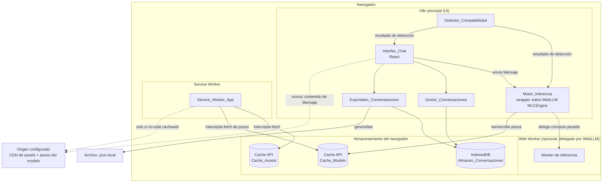
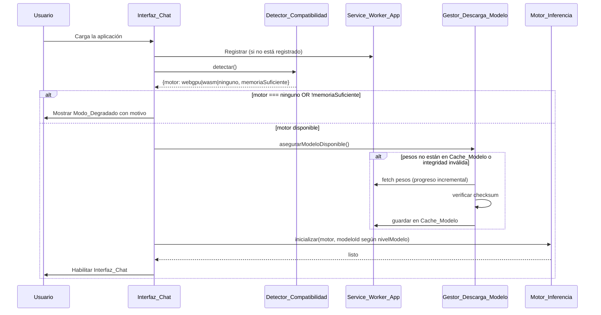

# Entre Nos IA

[](https://main.d2rq97p9u6kq38.amplifyapp.com)
[](LICENSE)

**Un asistente de IA conversacional que corre completo dentro de tu navegador — nunca en un servidor.**

*"Entre nos" = esto queda entre nosotros.* Es el nombre y es la tesis del proyecto: tus
conversaciones no salen de tu dispositivo, y no dependen de que un tercero les pague la factura de
inferencia.

**[👉 Probalo ahora](https://main.d2rq97p9u6kq38.amplifyapp.com)** — Chrome/Edge recientes con
WebGPU recomendado. La primera carga descarga el modelo (entre ~0.9 GB y ~3 GB según tu
dispositivo) y puede tardar unos minutos; después queda en cache y funciona offline.


## El problema

Usar un asistente de IA hoy casi siempre implica una de dos cosas: mandar el contenido de tus
conversaciones a un servidor de un tercero, o pagar por token a un proveedor. Para charlas que
preferís que no salgan de tu equipo — trabajo, salud, lo que sea — ninguna de las dos opciones es
ideal.

## La solución

Entre Nos IA ejecuta un modelo Llama-3.2 completo **dentro del navegador**, vía WebGPU (o WASM como
alternativa), usando [WebLLM](https://github.com/mlc-ai/web-llm). No hay backend propio: el único
servidor en todo el sistema es un CDN que sirve archivos estáticos. Ninguna ruta de código envía el
contenido de un mensaje por red — y eso no es una promesa de marketing, está verificado con tests
automatizados (ver [Privacidad verificable](#privacidad-verificable)).

## Funcionalidades

- Chat con streaming de tokens en tiempo real, con opción de cancelar la generación sin perder el
  texto parcial ya producido.
- Reintentar un mensaje tras un error, sin tener que reescribirlo.
- Múltiples conversaciones: crear, renombrar, borrar (con reselección automática de la conversación
  activa al borrarla).
- Exportar/importar una conversación completa a un archivo `.json`.
- Renderer de markdown propio (sin dependencias, sin `dangerouslySetInnerHTML`), tolerante a texto
  parcial mientras el modelo todavía está generando.
- Modo oscuro/claro (sigue la preferencia del sistema, con toggle manual).
- Instalable como PWA, funciona offline después de la primera carga.
- Modo degradado explícito con el motivo exacto (sin WebGPU, sin WASM, memoria insuficiente) cuando
  el dispositivo no puede correr el modelo — nunca un chat roto en silencio.
- Indicadores de estado en el header: motor activo (WebGPU/WebAssembly), conexión, versión de la
  app, botón de instalación PWA.

## Por qué es distinto

| | Entre Nos IA | Chat web tradicional (ChatGPT, Claude, etc.) | Ollama / LM Studio |
|---|---|---|---|
| Dónde corre la inferencia | En tu navegador | En el servidor del proveedor | En tu máquina, local |
| Instalación requerida | Ninguna — es una URL | Ninguna | Sí, un binario/app nativa |
| Conversaciones salen del dispositivo | Nunca (verificado con tests) | Sí, siempre | Nunca |
| Costo de operación | Cero | Suscripción o pago por token | Cero |
| Funciona offline | Sí, tras la primera carga | No | Sí |
| Dispositivo mínimo | Navegador con WebGPU o WASM | Cualquiera con internet | Requiere instalar software |

## Privacidad verificable

`src/testing/networkSpy.ts` intercepta `fetch`, `XMLHttpRequest` y `WebSocket` durante los tests.
Sobre esa base:

- `src/testing/absenceOfNetworkTransmission.property.test.ts` — property-based test que prueba,
  sobre conversaciones generadas aleatoriamente, que ningún contenido de mensaje sale por ninguno
  de esos tres canales.
- `src/testing/absenceOfTelemetrySdks.test.ts` — audita estáticamente el árbol transitivo completo
  de `package-lock.json` contra una lista de SDKs de analytics/telemetría conocidos.

Reproducilo vos mismo:

```bash
npm run test -- src/testing
```

## Arquitectura



### Flujo de arranque



## Decisiones técnicas

**Motor de inferencia: WebLLM sobre Transformers.js.** WebLLM tiene soporte de primera clase para
modelos conversacionales grandes (7B-8B cuantizados) y una API de streaming compatible con la forma
de OpenAI; Transformers.js está más orientado a tareas de NLP puntuales con modelos chicos. Detalle
completo de la comparación en
[`design.md`](.kiro/specs/asistente-ia-local/design.md#decisión-tecnológica-motor-de-inferencia).

**Selección de modelo en dos ejes independientes** (no un 1-de-4), en
`src/app-state/configuration.ts` / `src/compatibility-detector/decide.ts`:
- **Tamaño**: `compact` (Llama-3.2-1B, ~0.88 GB) en móviles o dispositivos con `memoryGB < 8`;
  `full` (Llama-3.2-3B, ~2.26 GB) en el resto. `navigator.deviceMemory` está cuantizado y capado en
  8, así que 8 es el único valor que indica confiablemente "tope de rango".
- **Cuantización**: `q4f16_1` si el adapter WebGPU soporta la extensión `shader-f16`; si no,
  fallback a `q4f32_1`. Sin este fallback, WebLLM revienta con `ShaderF16SupportError` antes de
  descargar pesos (común en drivers Adreno/Mali de Android).
- La ventana de contexto también se reduce a 2048 tokens (de 4096) en el tier `compact`, para bajar
  la huella del KV-cache en memoria durante la generación.

**Persistencia: IndexedDB vía Dexie**, con transacciones que revierten automáticamente ante una
excepción — necesario para el fallo atómico exigido por el diseño.

## Construido con Kiro

Este proyecto se desarrolló con el flujo **spec-driven** de Kiro, de punta a punta:

- [`requirements.md`](.kiro/specs/asistente-ia-local/requirements.md) — 12 requisitos en formato
  EARS, con un glosario de dominio de 19 términos.
- [`design.md`](.kiro/specs/asistente-ia-local/design.md) — arquitectura, decisiones técnicas,
  13 propiedades de corrección mapeadas a sus tests.
- [`tasks.md`](.kiro/specs/asistente-ia-local/tasks.md) — plan de implementación, **97/97 tareas
  completadas**.

La trazabilidad no es solo documental: la mayoría de los archivos en `src/` llevan un comentario
que apunta a la sección exacta de `design.md` y a los números de requisito que implementan (por
ejemplo, `src/compatibility-detector/decide.ts`).

El contexto persistente del proyecto para el flujo de Kiro vive en `.kiro/steering/` (producto,
stack técnico, convenciones de estructura), y `.kiro/hooks/` automatiza correr los tests de un
componente al guardar un archivo bajo `src/`.

## Software funcional

- 65 archivos de test, 356 casos, 13 de ellos property-based testing con
  [fast-check](https://github.com/dubzzz/fast-check) (mínimo 100 corridas cada uno). Convenciones
  en [`src/testing-conventions.md`](src/testing-conventions.md).
- ~94% de cobertura de statements (`npm run test:coverage`).

## Desplegado en AWS Amplify Hosting

La aplicación se despliega como sitio estático en **AWS Amplify Hosting**: no hay backend propio,
Amplify solo construye el proyecto y sirve el contenido de `dist/` por HTTPS. Esto no es el mínimo
esfuerzo — es la misma decisión arquitectónica de "cero servidor de aplicación en runtime" que
define el resto del sistema, aplicada también al despliegue.

### Qué hace el pipeline

En cada push a la rama configurada, Amplify ejecuta el build spec de `amplify.yml` (raíz del
repo):

```bash
nvm install 22
nvm use 22
npm ci
npm run lint
npm run test
npm run build
```

Si `lint`, `test` o `build` fallan, el despliegue se aborta y la versión previamente publicada
sigue disponible. Los artifacts publicados son el contenido de `dist/`.

### Por qué no hace falta más infraestructura

- **Sin variables de entorno ni secretos**: los identificadores de modelo son constantes de código
  (`src/app-state/configuration.ts`), no credenciales; WebLLM descarga los pesos directamente desde
  el catálogo de MLC-AI en tiempo de ejecución del navegador, no en build.
- **Sin reglas de rewrite/redirect tipo SPA**: no hay React Router, un único punto de entrada
  (`index.html`).

### Cabeceras de seguridad y cache

`amplify.yml` define `X-Frame-Options: DENY`, `Content-Security-Policy: frame-ancestors 'none'` y
`X-Content-Type-Options: nosniff` para todo el sitio; `Cache-Control: no-cache` para `index.html` y
`sw.js` (así el navegador siempre revalida y detecta una nueva versión), y cache inmutable de un
año para `/assets/**` (los nombres de archivo incluyen un hash de contenido generado por Vite).

Detalle completo del razonamiento en la sección "Despliegue" de
[`design.md`](.kiro/specs/asistente-ia-local/design.md), y los criterios de aceptación en el
Requisito 12 de [`requirements.md`](.kiro/specs/asistente-ia-local/requirements.md).

## Desarrollo local

### Requisitos

- Node.js 20.19+ o 22.12+
- Un navegador con WebGPU (Chrome/Edge recientes) o, como alternativa, soporte de WebAssembly

### Instalación

```bash
npm install
```

### Desarrollo

```bash
npm run dev
```

Levanta el servidor de desarrollo de Vite (por defecto en `http://localhost:5173`).

> **Nota:** en modo desarrollo el Service Worker está deshabilitado (`devOptions.enabled: false` en
> `vite.config.ts`), así que no vas a ver el comportamiento offline/PWA real con `npm run dev`. Para
> probar eso, usá `npm run build` + `npm run preview`.

### Build de producción y preview

```bash
npm run build
npm run preview
```

`npm run preview` sirve el build generado en `dist/`, incluyendo el Service Worker real (cacheo de
assets, funcionamiento offline, instalación como PWA).

### Tests, cobertura y lint

```bash
npm run test           # corre toda la suite una vez
npm run test:watch     # modo watch
npm run test:coverage  # suite + reporte de cobertura (v8)
npm run lint           # ESLint
```

### Configuración del modelo

La aplicación selecciona uno de cuatro modelos del catálogo pre-construido de
[WebLLM](https://github.com/mlc-ai/web-llm) según el dispositivo (ver
[Decisiones técnicas](#decisiones-técnicas)): `MODEL_ID_FULL`, `MODEL_ID_FULL_F32`,
`MODEL_ID_COMPACT` y `MODEL_ID_COMPACT_F32` en `src/app-state/configuration.ts`, resueltos por
`modelIdForTier()`. No necesitás alojar ni administrar ningún archivo de pesos: WebLLM los descarga
y cachea automáticamente en el navegador (Cache API) la primera vez, y los reutiliza desde cache en
cargas posteriores.

Si querés cambiar alguno de los cuatro modelos, reemplazalo por cualquier `model_id` válido del
catálogo de WebLLM (ver [la lista completa](https://github.com/mlc-ai/web-llm/blob/main/src/config.ts)),
y actualizá `REQUIRED_MODEL_VERSION` en `src/service-worker-app/sw.ts` para que coincida.

La primera carga descarga varios cientos de MB a GB (según el modelo), así que puede tardar unos
minutos dependiendo de tu conexión. Requiere internet la primera vez; las cargas posteriores usan
el cache del navegador y funcionan offline (una vez instalada como PWA).

## Licencia

[Apache License 2.0](LICENSE).
